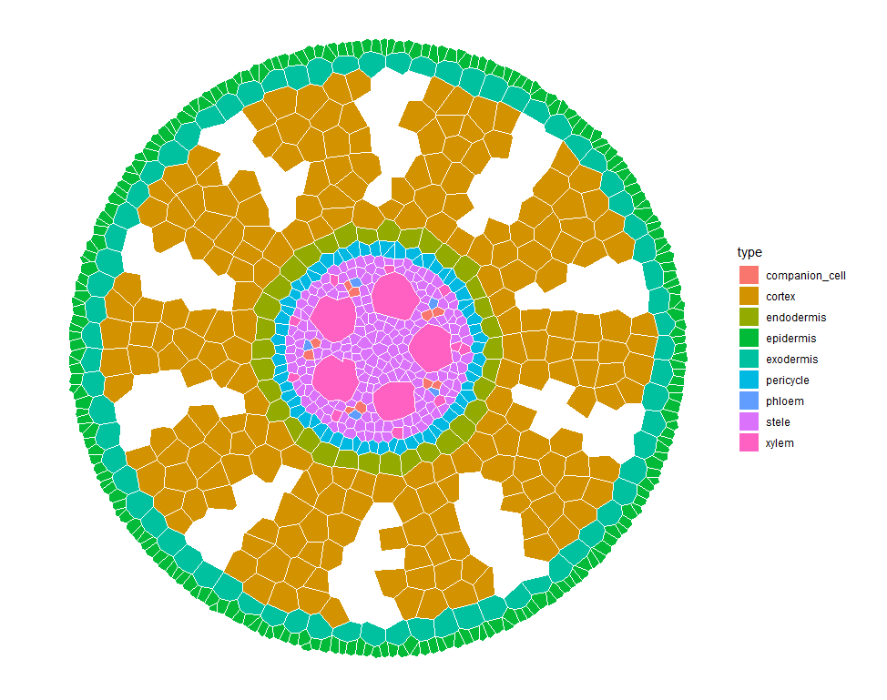

# What is GRANAR?

GRANAR stand for Generator of Root ANAtomy in R. The GRANAR model is able to generate complete cell networks of a root cross-sections using a small set of root anatomical features. The root anatomical features can typically be gathered by using software image analysis such as [ImageJ](https://imagej.net/Welcome). Once the root anatomy is created, the cell network can be saved as an eXtended Markup Language (XML) file. The structure of the XML files created by GRANAR are identical to the ones created of [CellSeT](https://www.nottingham.ac.uk/research/groups/cvl/software/cellset.aspx) (a software which digitize root anatomical network).

# How to use GRANAR?

GRANAR is an R package. The *'granar'* package can be found on [GitHub](https://github.com/granar/granar).
Alternatively, by simply executing the following line in the [R](https://cran.r-project.org/) environment:

```{r}
install.packages("devtools")
library(devtools)
install_github("granar/grarar")
library(granar)
```

```{r preambule, echo=T, warning=F, message=F}
# Load the libraries
library(xml2)
library(tidyverse)
library(plyr)
library(deldir)
library(alphahull)
library(viridis)
library(cowplot)
library(retistruct)
library(Hmisc)
```

```{r}
# Read the parameters
params <- read_param_xml("Zea_mays_1_Heymans_2019.xml")
```

```{r GRANAR, message = F, warning= F}
# Run the model

sim <- create_anatomy(parameters = params)
```

```{r plot}
# plot the output
plot_anatomy(sim, col = "type")
```


