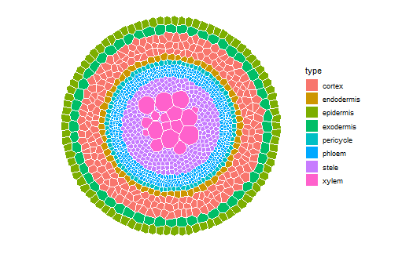

# What is [GRANAR](https://granar.github.io/)?

GRANAR stand for Generator of Root ANAtomy in R. The GRANAR model is able to generate complete cell networks of a root cross-sections using a small set of root anatomical features. The root anatomical features can typically be gathered by using software image analysis such as [ImageJ](https://imagej.net/Welcome). Once the root anatomy is created, the cell network can be saved as an eXtended Markup Language (XML) file. The structure of the XML files created by GRANAR are identical to the ones created of [CellSeT](https://www.nottingham.ac.uk/research/groups/cvl/software/cellset.aspx) (a software which digitize root anatomical network).

# What is [MECHA](https://mecharoot.github.io/) ?

MECHA is an explicit cross-section model of the root hydraulic anatomy which connects hydraulic concepts across scales.

The model computes horizontal water flow at the level of individual cells, quantifies the contribution of water composite pathways, and predicts root radial permeability (kr), using detailed anatomical descriptions and experimental data on the permeability of cell walls (kw), membranes (Lp) and the conductance of individual plasmodesmata (KPD).

# How to use GRANAR-MECHA ?

The pipeline GRANAR-MECHA allows the investigation of the effect of anatomy on radial hydraulic conductivity. 

From simple parameters measured on cross-section pictures, GRANAR can generate an anatomy that can be enter into MECHA to compute its radial conductivity.

[Here](https://granar.github.io/granar_examples/) is a detailed user guide. 

<!--  -->
<!--  -->
<!--  -->

